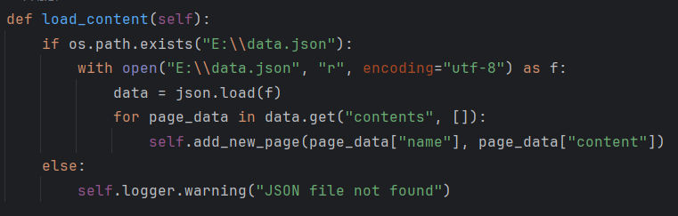
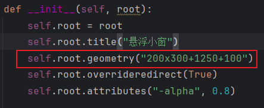

# 桌面便签


## 运行环境

```shell
pip install tk==0.1.0
pip install pyinstaller==6.9.0
```

## 打包

```shell
pyinstaller --onefile --noconsole floating_window.py
```

## 安装

在C:\Users\用户名\AppData\Roaming\Microsoft\Windows\Start Menu\Programs\Startup目录下放置打包的exe文件，便签开机自启

## tips



更改data.json设置便签内容存储位置



更改这个位置参数设置窗口位置，当前位置（1250，100），窗口大小200*300
